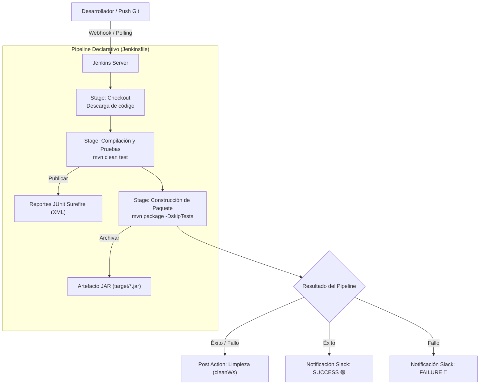

#  Integración Continua con Jenkins, Maven y Notificaciones en Slack

[](https://www.oracle.com/java/)
[](https://maven.apache.org/)
[](https://junit.org/junit5/)
[](https://www.jenkins.io/)
[](https://slack.com/)

Proyecto académico y demostrativo desarrollado para la unidad de **Pruebas de Software**. Implementa un pipeline completo de **Integración Continua (CI)** utilizando **Jenkins Declarativo**, compilación y ejecución de pruebas unitarias automatizadas con **Apache Maven** y **JUnit 5**, empaquetado de artefactos JAR y preparación para el envío de alertas y notificaciones a canales de **Slack**.

--

## 📋 Tabla de Contenidos

- [Integración Continua con Jenkins, Maven y Notificaciones en Slack](#integración-continua-con-jenkins-maven-y-notificaciones-en-slack)
  - [📋 Tabla de Contenidos](#-tabla-de-contenidos)
  - [Descripción General](#descripción-general)
  - [Arquitectura del Flujo CI/CD](#arquitectura-del-flujo-cicd)
  - [Estructura del Proyecto](#estructura-del-proyecto)
  - [Componentes y Pruebas Unitarias](#componentes-y-pruebas-unitarias)
    - [1. `Calculator.java`](#1-calculatorjava)
    - [2. `CalculatorTest.java` (JUnit 5)](#2-calculatortestjava-junit-5)
  - [Requisitos Previos](#requisitos-previos)
  - [Guía de Ejecución Local](#guía-de-ejecución-local)
    - [1. Clonar el Repositorio](#1-clonar-el-repositorio)
    - [2. Ejecutar Pruebas Unitarias](#2-ejecutar-pruebas-unitarias)
    - [3. Empaquetar el Artefacto (JAR)](#3-empaquetar-el-artefacto-jar)
    - [4. Ejecutar la Aplicación](#4-ejecutar-la-aplicación)
  - [Pipeline en Jenkins (`Jenkinsfile`)](#pipeline-en-jenkins-jenkinsfile)
    - [Características del Pipeline:](#características-del-pipeline)
  - [Configuración de Notificaciones con Slack](#configuración-de-notificaciones-con-slack)
    - [Paso 1: Configurar la App en Slack](#paso-1-configurar-la-app-en-slack)
    - [Paso 2: Configurar Jenkins](#paso-2-configurar-jenkins)
    - [Paso 3: Activar las Notificaciones en `Jenkinsfile`](#paso-3-activar-las-notificaciones-en-jenkinsfile)

---

## Descripción General

El propósito del proyecto es evidenciar las buenas prácticas de desarrollo ágil y control de calidad de software mediante:
1. **Desarrollo de lógica de negocio desacoplada**: Clase `Calculator` con operaciones aritméticas y manejo de excepciones controladas.
2. **Automatización de Pruebas con JUnit 5**: Cobertura de caminos positivos, negativos, pruebas parametrizadas y validación de excepciones.
3. **Pipeline Declarativo en Jenkins**: Automatización de descarga, compilación, ejecución de tests, publicación de reportes Surefire y empaquetado.
4. **Retroalimentación en Tiempo Real**: Envío del estado de la construcción (*SUCCESS* / *FAILURE*) hacia un espacio de trabajo en Slack.

---

## Arquitectura del Flujo CI/CD



---

## Estructura del Proyecto

```text
jenkins-slack/
├── .idea/                           # Configuraciones de IDE IntelliJ
├── src/
│   ├── main/
│   │   └── java/
│   │       └── pe/edu/vallegrande/
│   │           ├── Calculator.java  # Lógica principal de la calculadora
│   │           └── Main.java        # Punto de entrada / Demostración por consola
│   └── test/
│       └── java/
│           └── pe/edu/vallegrande/
│               └── CalculatorTest.java # Suite de pruebas unitarias JUnit 5
├── .gitignore                       # Exclusiones de Git (target, IDEs, OS)
├── Jenkinsfile                      # Definición del pipeline CI/CD en Jenkins
├── pom.xml                          # Configuración de dependencias y plugins Maven
└── README.md                        # Documentación técnica del proyecto
```

---

## Componentes y Pruebas Unitarias

### 1. `Calculator.java`
Provee las 4 operaciones aritméticas fundamentales para números de precisión doble (`double`):
- `add(double a, double b)`: Suma dos operandos.
- `subtract(double a, double b)`: Resta dos operandos.
- `multiply(double a, double b)`: Multiplica dos operandos.
- `divide(double a, double b)`: Realiza la división y arroja una excepción `IllegalArgumentException("No se puede dividir entre cero")` si el divisor es `0.0`.

### 2. `CalculatorTest.java` (JUnit 5)
Implementa 8 casos de prueba exhaustivos que validan:
- **Pruebas Unitarias Simples**: Verificación con delta flotante (`0.0001`).
- **Pruebas Parametrizadas (`@ParameterizedTest` + `@CsvSource`)**: Validación de múltiples pares de valores para la suma (positivos, decimales, negativos).
- **Control de Excepciones (`assertThrows`)**: Asegura que la división por cero lance la excepción y el mensaje correspondiente.

Resumen de casos de prueba:
| Método de Prueba | Tipo | Descripción |
| :--- | :--- | :--- |
| `testAdd` | `@Test` | Valida sumas con valores positivos y negativos |
| `testSubtract` | `@Test` | Valida restas y preservación de signos |
| `testMultiply` | `@Test` | Valida multiplicación con ceros, positivos y negativos |
| `testDivide` | `@Test` | Valida división exacta y decimales |
| `testDivideByZero` | `@Test` | Valida lanzamiento de `IllegalArgumentException` ante divisor cero |
| `testParameterizedAdd` | `@ParameterizedTest` | Evalúa 3 casos de prueba con diferentes combinaciones numéricas |

---

## Requisitos Previos

- **Java Development Kit (JDK)**: Versión 17 o superior.
- **Apache Maven**: Versión 3.8.0 o superior.
- **Git**: Para el control de versiones.
- **Jenkins**: Con soporte para Pipelines y plugin de Maven instalado.
- *(Opcional)* **Cuenta de Slack**: Para configurar el bot y canal de notificaciones.

---

## Guía de Ejecución Local

### 1. Clonar el Repositorio
```bash
git clone https://github.com/LeonardoHuamanMezarina/jenkins-slack.git
cd jenkins-slack
```

### 2. Ejecutar Pruebas Unitarias
Compila el proyecto y ejecuta la suite de tests de JUnit 5 con Maven Surefire:
```bash
mvn clean test
```
Los reportes XML se generarán en la carpeta `target/surefire-reports/`.

### 3. Empaquetar el Artefacto (JAR)
Genera el paquete ejecutable `.jar` omitiendo los tests (o incluyéndolos):
```bash
mvn package
```
El archivo JAR resultante se encontrará en `target/test-jenkins-1.0-SNAPSHOT.jar`.

### 4. Ejecutar la Aplicación
Puedes ejecutar la clase principal `Main` directamente desde Maven o con Java:
```bash
# Opción A: Con Java directo
java -cp target/test-jenkins-1.0-SNAPSHOT.jar pe.edu.vallegrande.Main

# Opción B: Con Maven Exec Plugin
mvn compile exec:java -Dexec.mainClass="pe.edu.vallegrande.Main"
```

Salida esperada en consola:
```text
=== Calculadora Simple ===
5 + 3 = 8.0
10 - 4 = 6.0
6 * 7 = 42.0
20 / 4 = 5.0
```

---

## Pipeline en Jenkins (`Jenkinsfile`)

El pipeline está estructurado de manera declarativa con los siguientes bloques clave:

```groovy
pipeline {
    agent any

    tools {
        maven 'Maven 3' // Herramienta configurada en Global Tool Configuration
    }

    stages {
        stage('Checkout') {
            steps {
                echo 'Descargando código del repositorio...'
                checkout scm
            }
        }

        stage('Compilación y Pruebas') {
            steps {
                echo 'Ejecutando pruebas unitarias de la Calculadora...'
                sh 'mvn clean test'
            }
            post {
                always {
                    // Publica los reportes de pruebas JUnit en Jenkins
                    junit testResults: 'target/surefire-reports/*.xml', allowEmptyResults: true
                }
            }
        }

        stage('Construcción de Paquete (JAR)') {
            steps {
                echo 'Generando archivo JAR...'
                sh 'mvn package -DskipTests'
            }
            post {
                success {
                    // Archiva el artefacto generado
                    archiveArtifacts artifacts: 'target/*.jar', allowEmptyArchive: false
                }
            }
        }
    }

    post {
        always {
            cleanWs() // Limpieza del espacio de trabajo
        }
        success {
            echo '¡El Pipeline se ejecutó exitosamente en Jenkins!'
            // Notificación a Slack en caso de éxito
        }
        failure {
            echo '¡Hubo un error en la ejecución del Pipeline!'
            // Notificación a Slack en caso de error
        }
    }
}
```

### Características del Pipeline:
- **Gestión de Herramientas**: Requiere que Jenkins tenga configurado el ejecutable de Maven bajo el alias `Maven 3`.
- **Publicación de Reportes**: La directiva `junit` procesa los archivos XML generados por `maven-surefire-plugin`, ofreciendo gráficos de tendencia de pruebas en la interfaz web de Jenkins.
- **Almacenamiento de Artefactos**: Conserva los binarios generados (`*.jar`) accesibles para despliegues posteriores.
- **Higiene de Espacio de Trabajo**: `cleanWs()` asegura que cada ejecución comience sin residuos de compilaciones previas.

---

## Configuración de Notificaciones con Slack

Para habilitar las alertas automáticas hacia Slack en el `Jenkinsfile`:

### Paso 1: Configurar la App en Slack
1. Ve a [Slack API](https://api.slack.com/apps) y crea una nueva aplicación en tu Workspace (o utiliza la integración de Jenkins para Slack).
2. Otorga los permisos de bot necesarios (ej. `chat:write`, `channels:read`).
3. Invita al bot al canal deseado (por ejemplo `#builds` o `#jenkins-ci`) con el comando:
   ```text
   /invite @NombreDeTuBot
   ```
4. Copia el **Bot User OAuth Token** generado (inicia con `xoxb-...`).

### Paso 2: Configurar Jenkins
1. Instala el plugin **Slack Notification** en `Administrar Jenkins` > `Plugins`.
2. En `Administrar Jenkins` > `Credentials`, añade una credencial de tipo **Secret text**:
   - **Secret**: El token `xoxb-...` de Slack.
   - **ID**: `slack-token`.
3. Ve a `Administrar Jenkins` > `System` > sección **Slack**:
   - **Workspace**: Nombre de tu espacio de trabajo en Slack.
   - **Credential**: Selecciona `slack-token`.
   - **Default channel**: Canal predeterminado (ej. `#builds`).
   - Prueba la conexión con el botón **Test Connection**.

### Paso 3: Activar las Notificaciones en `Jenkinsfile`
Descomenta las secciones en los bloques `post.success` y `post.failure`:

```groovy
post {
    always {
        cleanWs()
    }
    success {
        slackSend(
            channel: '#jenkins-ci',
            color: 'good',
            message: "✅ SUCCESS: Build #${env.BUILD_NUMBER} de ${env.JOB_NAME} (${env.BUILD_URL})"
        )
    }
    failure {
        slackSend(
            channel: '#jenkins-ci',
            color: 'danger',
            message: "❌ FAILED: Build #${env.BUILD_NUMBER} de ${env.JOB_NAME} (${env.BUILD_URL})"
        )
    }
}
```

---